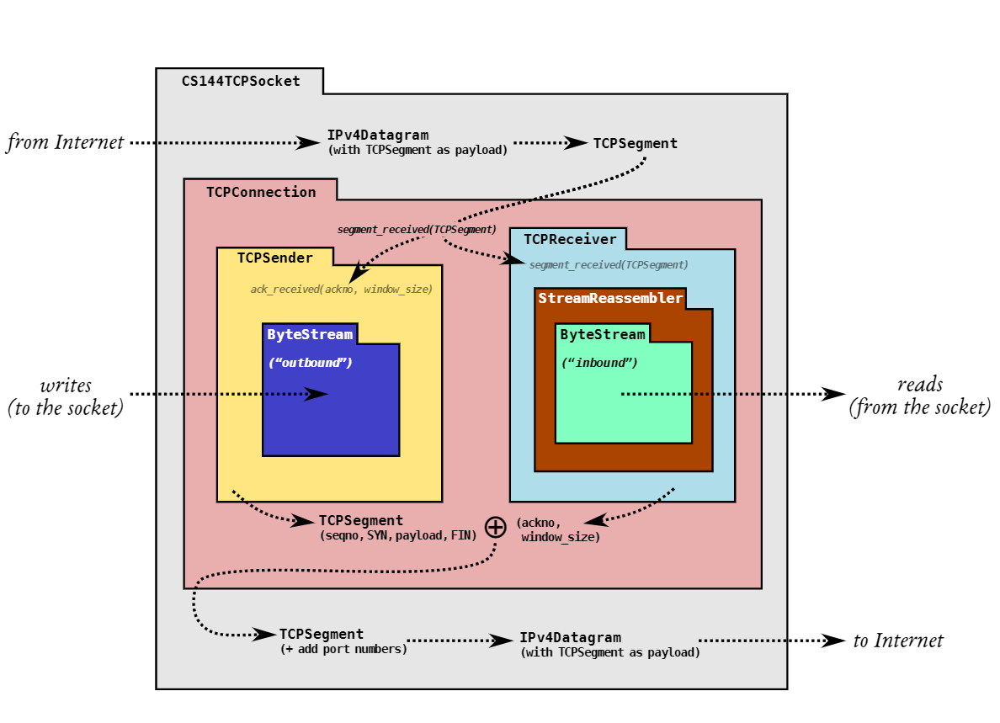

# Lab Checkpoint 1: stitching substrings into a byte stream

## 1. Overview


**ByteStream** -> **StreamReassembler** -> **TCPReceiver,TCPSender** -> **TCPConnection**

## 2. Getting started

- Fetch and merg

    ```git
    git fetch
    git merge origin/lab1-startercode
    ```

- Then `make`

## 3. Putting substrings in sequence

- Data structure
  
  ```cpp
  std::set<std::pair<uint64_t, std::string>> _unassembled{};
  uint64_t _assembled_end_index{0};
  size_t _unassembled_bytes{0};
  bool _eof{false};
  ```

- Add a function to judge eof
  
  ```cpp
  void judge_eof(const bool &);

  void StreamReassembler::judge_eof(const bool &eof) {
    _eof = _eof | eof;
    if (_eof && empty())
        _output.end_input();
  }
  ```

- Other functions

  ```cpp
  size_t StreamReassembler::unassembled_bytes() const { return _unassembled_bytes; }

  bool StreamReassembler::empty() const { return _unassembled.empty(); }
  ```

- `push_substring`
  A set to save all the unassembled data, similar to [this leetcode problem](https://leetcode.com/problems/count-integers-in-intervals/)

  ```cpp
  void StreamReassembler::push_substring(const string &data, const size_t index, const bool eof) {
    // out of capacity || empty data
    if (_assembled_end_index + _capacity < index || data == "") {
        judge_eof(eof);
        return;
    }

    // cal offset
    uint64_t offset = index < _assembled_end_index ? _assembled_end_index - index : 0;
    // assemabled
    if (data.size() < offset)
        return;
    size_t index_copy = index + offset;
    string data_copy = std::string(data.begin() + offset, data.end());

    // firstly put data to set using interval merging
    auto t = _unassembled.upper_bound(make_pair(index_copy, std::string{}));
    vector<pair<uint64_t, std::string>> erasing;
    // judge t-1
    if (t != _unassembled.begin()) {
        t--;
        if (t->first + t->second.size() >= index_copy) {
            if (t->first + t->second.size() >= index_copy + data_copy.size())
                data_copy = t->second;
            else
                data_copy = t->second +
                            std::string(data_copy.begin() + t->second.size() - index_copy + t->first, data_copy.end());
            index_copy = t->first;
            erasing.push_back(*t);
        }
        t++;
    }
    // judge following
    while (t != _unassembled.end() && t->first <= index_copy + data_copy.size()) {
        if (t->first + t->second.size() >= index_copy + data_copy.size())
            data_copy += std::string(
                t->second.end() - static_cast<size_t>(t->first + t->second.size() - index_copy - data_copy.size()),
                t->second.end());
        erasing.push_back(*(t++));
    }
    // erase
    for (auto &to_erase : erasing) {
        _unassembled_bytes -= to_erase.second.size();
        _unassembled.erase(to_erase);
    }
    // insert
    if (!data_copy.empty()) {
        _unassembled_bytes += data_copy.size();
        _unassembled.emplace(make_pair(index_copy, data_copy));
    }

    // then put data in set to _output if legal
    uint64_t next_index = _unassembled.begin()->first;
    string wait_write = _unassembled.begin()->second;
    if (next_index == _assembled_end_index) {
        size_t written_byte = _output.write(wait_write);
        if (written_byte == wait_write.size()) {
            _unassembled_bytes -= wait_write.size();
            _unassembled.erase(_unassembled.begin());
        } else {
            uint64_t i = _assembled_end_index + written_byte;
            std::string s = std::string(wait_write.begin() + written_byte, wait_write.end());
            _unassembled_bytes -= wait_write.size();
            _unassembled.erase(_unassembled.begin());
            if (!s.empty()) {
                _unassembled_bytes += s.size();
                _unassembled.emplace(make_pair(i, s));
            }
        }
        _assembled_end_index += written_byte;
    }

    judge_eof(eof);
  }
  ```
