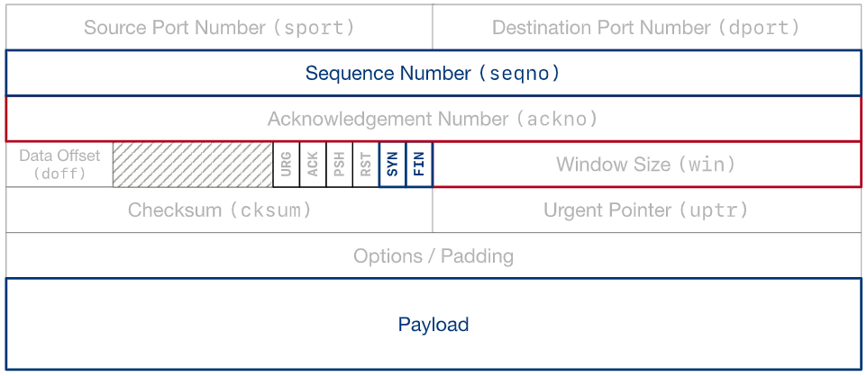
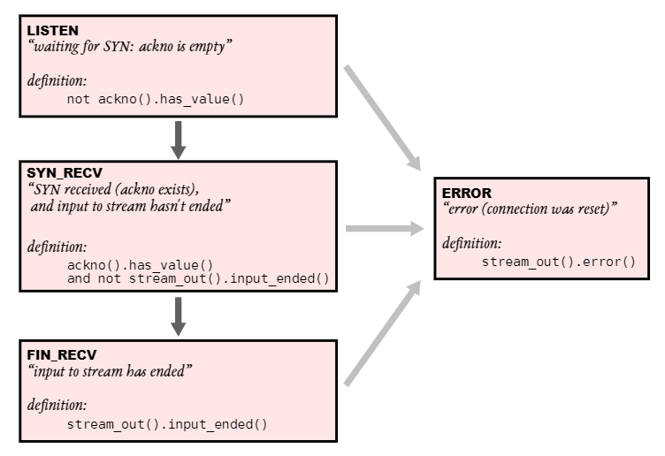

# Lab Checkpoint 2: the TCP receiver

## 1. Overview

- The `TCPReceiver` receives segments from the Internet (via the `segment_received()` method) and turns them into calls to your `StreamReassembler`, which eventually writes to the incoming `ByteStream`.
- The `TCPReceiver` is responsible for telling the sender two things:
  - the index of the “first unassembled” byte, which is called the “acknowledgment number” or “**ackno**”. This is the first byte that the receiver needs from the sender.
  - the distance between the “first unassembled” index and the “first unacceptable” index. This is called the “**window size**”.
- Together, the **ackno** and **window size** describe describes the receiver’s window.

## 2. Getting started

- Fetch and merg

    ```bash
    git fetch
    git merge origin/lab2-startercode
    ```

- Then `make`

## 3. Lab 2: The TCP Receiver

### 3.1 Translating between 64-bit indexes and 32-bit seqnos

- Your implementation needs to plan for 32-bit integers to wrap around.
- TCP sequence numbers start at a random value.
- The logical beginning and ending (SYN, FIN) each occupy one sequence number.
- Three different types of indexing involved in TCP:
    Sequence Numbers | Absolute Sequence Numbers | Stream Indices
    -|-|-
    Start at the ISN | Start at 0 | Start at 0
    Include SYN/FIN | Include SYN/FIN | Omit SYN/FIN
    32 bits, wrapping | 64 bits, non-wrapping | 64 bits, non-wrapping
    “seqno” | “absolute seqno” | “stream index”
- `wrap`: just add them.

  ```cpp
  WrappingInt32 wrap(uint64_t n, WrappingInt32 isn) {return WrappingInt32{static_cast<uint32_t>(n) + isn.raw_value()}; }
  ```
  
- `unwrap`: the **closest**.

  ```cpp
  uint64_t unwrap(WrappingInt32 n, WrappingInt32 isn, uint64_t checkpoint) {
    uint32_t offset = n.raw_value() - isn.raw_value();
    uint64_t base = (checkpoint & (static_cast<uint64_t>(UINT32_MAX) << 32)) + offset;
    uint64_t base_b1 = base <= UINT32_MAX ? base : base - (1UL << 32),
             base_l1 = base > (static_cast<uint64_t>(UINT32_MAX) << 32) ? base : base + (1UL << 32);
    auto dis2checkpoint = [&checkpoint](uint64_t &a) { return min(a - checkpoint, checkpoint - a); };
    if (dis2checkpoint(base) > dis2checkpoint(base_b1))
        base = base_b1;
    if (dis2checkpoint(base) > dis2checkpoint(base_l1))
        base = base_l1;
    return base;
  }
  ```

### 3.2 Implementing the TCP receiver

- TCP receiver:
  - (1) receive segments from its peer,
  - (2) reassemble the ByteStream using your StreamReassembler, and
  - (3) calculate the acknowledgment number (ackno) and the window size.
- TCPSegement
  
- Add a funcyion in `stream_reassembler.hh/cc` to get num of data written into buffer.
  
  ```cpp
    uint64_t get_assembled_end_index();
    uint64_t StreamReassembler::get_assembled_end_index() { return _assembled_end_index; }
  ```

- Data structure

  ```cpp
    bool _SYN{false};

    uint32_t _isn{};
    uint32_t _ackno{};

    uint64_t _absolute_seqno{};
    uint64_t _data_seqno{};
  ```

- `segment_received`

  ```cpp
  void TCPReceiver::segment_received(const TCPSegment &seg) {
    // solve SYN
    if (seg.header().syn) {
        _SYN = true;
        _isn = seg.header().seqno.raw_value();
    }
    // update absolute seqno
    _absolute_seqno = unwrap(WrappingInt32(seg.header().seqno), WrappingInt32(_isn), _absolute_seqno);
    _data_seqno = _absolute_seqno - !seg.header().syn;
    // push string
    if (_SYN) {
        _reassembler.push_substring(seg.payload().copy(), _data_seqno, seg.header().fin);
        _ackno = _isn + _SYN + _reassembler.stream_out().input_ended() + _reassembler.get_assembled_end_index();
    }
  }
  ```

- Other functions

  ```cpp
  optional<WrappingInt32> TCPReceiver::ackno() const {
    if (_SYN)
        return WrappingInt32(_ackno);
    return nullopt;
  }

  size_t TCPReceiver::window_size() const { return _capacity - _reassembler.stream_out().buffer_size(); }
  ```

## 3.3 Evolution of the TCPReceiver over the life of the connection

  
