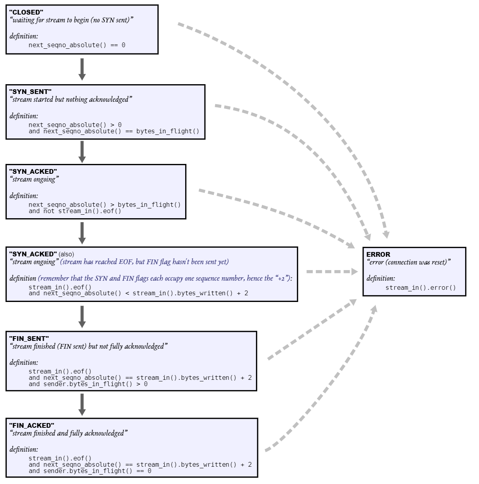

# Lab Checkpoint 3: the TCP sender

## 1. Overview

The TCPSender is a tool that translates from an outgoing byte stream to segments that will become the payloads of unreliable datagrams.

## 2. Getting started

- Fetch and merg

    ```bash
    git fetch
    git merge origin/lab3-startercode
    ```

## 3. Lab 3: The TCP Sender

`TCPSender`’s responsibility:

- Keep track of the receiver’s window (processing incoming acknos and window sizes)
- Fill the window when possible, by reading from the ByteStream, creating new TCP segments (including SYN and FIN flags if needed), and sending them. The sender
should keep sending segments until either the window is full or the ByteStream is empty.
- Keep track of which segments have been sent but not yet acknowledged by the receiver—we call these “outstanding” segments
- Re-send outstanding segments if enough time passes since they were sent, and they haven’t been acknowledged yet

### 3.1 How does the TCPSender know if a segment was lost?

- Use TCPSender’s `tick` method to timing
- Retransmission timeout (RTO) changs over time but the *initial value* not changes
- Retransmission timer: expires when the RTO has elapsed
- When sending segment, run a timer
- When all outstanding data has been acknowledged, stop the retransmission timer
- When the retransmission timer has expired:
  - Retransmit the earliest egment that hasn’t been fully acknowledged by the TCP receiver
  - If the windows size is nonzero: increment the number of consecutive retransmissions
  - Double the value of RTO.
- When ackno renew
  - Set RTO to *initial value*
  - Rest timer if have any outstanding data
  - Set *consecutive retransmissions* to zero

### 3.2 Implementing the TCP sender

- Data structure
  
  ```cpp
    //! our initial sequence number, the number for our SYN.
    WrappingInt32 _isn;

    //! outbound queue of segments that the TCPSender wants sent
    std::queue<TCPSegment> _segments_out{};
    std::queue<TCPSegment> _unack_segments_out{};

    //! retransmission timer for the connection
    unsigned int _initial_retransmission_timeout{};
    // RTO
    unsigned int _retransmission_timeout{};
    // timer
    uint64_t _timer{0};
    bool _timer_running{false};

    // consecutive retransmission
    uint64_t _consecutive_retransmission{0};

    //! outgoing stream of bytes that have not yet been sent
    ByteStream _stream;

    // ackno
    uint64_t _ackno{};
    //! the (absolute) sequence number for the next byte to be sent
    uint64_t _next_seqno{0};
    // data seqno
    uint64_t _data_seqno{0};

    // window size
    uint64_t _windows_size{};

    // _bytes_in_flight
    uint64_t _bytes_in_flight{0};

    // flag
    bool _SYN{false};
    bool _FIN{false};
  ```

- fill_window

  ```cpp
  void TCPSender::fill_window() {
    if (!_SYN) {
        TCPSegment seg;
        seg.header().syn = true;
        _SYN = true;
        send_segment(seg);
        return;
    }

    uint64_t window_size = max(_windows_size, 1UL);
    while (((window_size - (_next_seqno - _ackno) != 0)) && (!_FIN)) {
        TCPSegment seg;
        seg.payload() = Buffer(_stream.read(min(TCPConfig::MAX_PAYLOAD_SIZE, window_size - (_next_seqno - _ackno))));
        if (seg.length_in_sequence_space() < window_size && _stream.eof()) {
            seg.header().fin = true;
            _FIN = true;
        }
        if (seg.length_in_sequence_space() == 0)
            return;
        send_segment(seg);
    }
  }
  ```

- ack_received

  ```cpp
  void TCPSender::ack_received(const WrappingInt32 ackno, const uint16_t window_size) {
    if (unwrap(ackno, WrappingInt32(_isn), _next_seqno) > _next_seqno)
        return;
    _windows_size = window_size;
    if (unwrap(ackno, WrappingInt32(_isn), _next_seqno) <= _ackno)
        return;
    _ackno = unwrap(ackno, WrappingInt32(_isn), _next_seqno);
    while (!_unack_segments_out.empty()) {
        TCPSegment seg = _unack_segments_out.front();
        if (unwrap(seg.header().seqno, _isn, _next_seqno) + seg.length_in_sequence_space() <= _ackno) {
            _bytes_in_flight -= seg.length_in_sequence_space();
            _unack_segments_out.pop();
        } else {
            break;
        }
    }
    _retransmission_timeout = _initial_retransmission_timeout;
    _consecutive_retransmission = 0;

    if (!_unack_segments_out.empty()) {
        _timer_running = true;
        _timer = 0;
    }

    fill_window();
  }
  ```

- tick

  ```cpp
  void TCPSender::tick(const size_t ms_since_last_tick) {
    _timer += ms_since_last_tick;
    if (_timer >= _retransmission_timeout && !_unack_segments_out.empty()) {
        _segments_out.push(_unack_segments_out.front());
        _consecutive_retransmission++;
        _retransmission_timeout *= 2;
        _timer_running = true;
        _timer = 0;
    }
    if (_unack_segments_out.empty())
        _timer_running = false;
  }
  ```

- send_empty_segment

  ```cpp
  void TCPSender::send_empty_segment() {
    TCPSegment seg;
    seg.header().seqno = wrap(_next_seqno, _isn);
    _segments_out.push(seg);
  }
  ```

- Add a function send_segment

  ```cpp
  // send seg
  void send_segment(TCPSegment &seg);

  void TCPSender::send_segment(TCPSegment &seg) {
    seg.header().seqno = wrap(_next_seqno, _isn);
    _next_seqno += seg.length_in_sequence_space();
    _bytes_in_flight += seg.length_in_sequence_space();
    _unack_segments_out.push(seg);
    _segments_out.push(seg);
    if (!_timer_running) {
        _timer_running = true;
        _timer = 0;
    }
  }
  ```

- other function

  ```cpp
  uint64_t TCPSender::bytes_in_flight() const { return _bytes_in_flight; }

  unsigned int TCPSender::consecutive_retransmissions() const { return _consecutive_retransmission; }
  ```

### 3.3 Evolution of the TCP sender



### 3.4 FAQs and special cases
