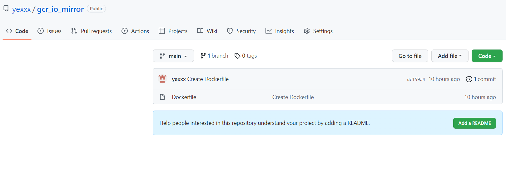

# Use aliyun as image mirror

For sometime we can't connect to some websites just like gcr.io. We can do with the following steps to pull an image from aliyun where we can always connect to.

1. Create a repo in github with dockerfile.
    

2. Create an aliyun repo and use code source from github.

3. Add build rule and build.

4. Now we can pull it from aliyun.
   `$ docker login --username=user_name registry.cn-hangzhou.aliyuncs.com`
   `$ docker pull registry.cn-hangzhou.aliyuncs.com/user_name/repo_name:tag`

5. Probably we need rename the image.
